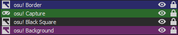

# osu! Stream Layout

Preview: 

(Previews are coming later)

Pre-configuration before setting up via OBS Studio:

0- Disable Fullscreen mode on osu!'s options;

1- osu! needs to be set to a custom resolution for this to fit properly, in case you don't want to edit "border.png" to fit your osu!'s window.

2- Go to your "osu!" folder, and open the .cfg related to your computer's UserName;

3- Ctrl+F "Height =". Replace the value with "1050", so it should look like: "Height = 1050";

4- Ctrl+F "Width =". Replace the value with "1920", so it should look like: "Width = 1920".

Note that this layout was made with DisplayFusion in mind, where I have a "Window Position" Profile where it basically moves the osu! window so the the titlebar is off-screen from the top, causing to fit perfectly with my taskbar.

That functionality with DisplayFusion is only available in the Paid version, so, instead, what I can recommend using is [AltSnap](https://github.com/RamonUnch/AltSnap).

On AltSnap, make sure to disable the following:

* Mimic Aero Snap;

* Smart Aero Snap dimensions;

* Smarter Aero Snap dimensions.

Now, move "osu!"'s window by holding Left Alt, then clicking and holding left-click, until the titlebar is no longer visible from the top, then let it go (the left-click button). You'll have to do this everytime you open osu!.

Once done, you can click on AltSnap's tray icon to disable window dragging with Left Alt + Holding Left Click, so it won't interfere with gameplay if you use the mouse buttons and Alt to play.

Instructions to set-up via OBS Studio:

1- Right click on "Scenes" empty box and create one for "osu!";

2- On the "Sources" empty box, go to "Add" and go to "Game Capture":

a) On "Mode", select "Capture specific window";

b) Window: "[osu!.exe]: osu!";

c) Window Match Priority: "Match title, otherwise find window of same executable";

d) You can also disable "Capture Cursor", as the one in-game show just fine (I did forget to disable this option on my video, though);

e) Press "OK".

3- Rename "Game Capture" to "osu! Capture" (you can do that by simply clicking on it from the Sources panel, and pressing F2);

4- Right-click on "osu! Capture", go to "Transform" and "Edit Transform":

a) On the Size section, make sure it's like this:
"Size: [1824.0000]↨ [998.0000]↨"

b) Press "Close".

5- Right-click on "osu! Capture" once again, and go to "Transform" then "Center to screen".

6- Right-click on the "Sources" box, and Add an Image.

7- Select the "border.png" image, and press "OK".

8- Now right-click on the image you just added (I recommend renaming to "osu! Border"), and once again, go to "Transform" then "Center to screen".

9- Right-click on the "Sources" box, and Add yet another Image.

10- Select "bg.png", and press "OK".

11- Rename it to something like "osu! Background", and right-click on it, then go to "Filters".

a) Right-click on the "Effect Filters" area, and go to "Add" then "Scroll";

b) Keep the Horizontal Speed value as "0.00", and change the Vertical Speed to "10.00";

c) Enable "Limit Height", and set it to "1080";

d) Enable "Loop";

e) Right-click on the "Effect Filters" area, and go to "Add" then "Color Correction";

f) Set the opacity value to "0.9000";

12- Right-click on "osu! Background" once again, and go to "Transform" then "Center to screen".

13- Right-click on the "Sources" box, and Add another image;

14- Select "black_square.png" image, and press "OK".

15- Rename to something like "osu! Black Square", right-click it, go to "Transform", and click "Center to Screen".

The order for the Sources tab should look like this:

