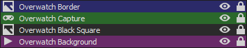

# Overwatch Stream Layout

Preview: 

Pre-configuration before setting up via OBS Studio:

1- Open Overwatch 2. Once on the Main Menu screen, press ESC;

2- Go to "Options";

3- Go to the "Video" tab;

4- Select your "Display Mode" as Borderless Windowed. Keep Overwatch 2 open;

5- Download Infinite Screen. It's available [here](https://web.archive.org/web/20221216153514/http://ynea.futureware.at/cgi-bin/infinite_screen.pl)(archived)¹ (link available on the blue "Infinite_Screen_v1.72.exe" text);

⎯⎯⎯⎯⎯⎯⎯⎯⎯⎯⎯⎯⎯⎯⎯⎯⎯⎯⎯⎯⎯⎯⎯⎯⎯⎯⎯⎯⎯⎯⎯⎯⎯⎯⎯⎯⎯⎯⎯⎯⎯⎯⎯⎯⎯⎯⎯⎯⎯⎯⎯⎯⎯⎯⎯⎯⎯⎯⎯⎯⎯⎯⎯⎯⎯⎯⎯⎯⎯⎯⎯⎯⎯⎯⎯⎯⎯⎯⎯⎯⎯⎯⎯⎯⎯⎯⎯⎯⎯⎯⎯⎯⎯⎯⎯⎯⎯⎯⎯⎯⎯⎯⎯⎯⎯⎯⎯⎯⎯⎯⎯⎯⎯⎯⎯⎯⎯⎯⎯⎯⎯⎯⎯⎯⎯⎯

***Note: Although I'm recommending this software to use (as I don't know any other free software that could do the same thing, the only other one that I know that has such funcionality is DisplayFusion, which has said functionality only on the paid version), Infinite Screen is an old and obscure software.***

***Additionally, in case you wish to uninstall it someday, just deleting "Infinite_screen_v1.72.exe" won't be enough, as the files for the software will still be located at "AppData\Local\Temp\infinite_screen\perl\bin". You can delete all files from this folder in case you don't wish to use the program anymore, or the entire "infinite_screen" folder inside "Temp", which will also get rid of your saved settings.***

¹: Due to the obscurity of the website that this software originated, I decided to include as an archive link from the Way Back Machine, in case the "futureware" website goes down someday and the new domain owner hosts a completely different webpage.

⎯⎯⎯⎯⎯⎯⎯⎯⎯⎯⎯⎯⎯⎯⎯⎯⎯⎯⎯⎯⎯⎯⎯⎯⎯⎯⎯⎯⎯⎯⎯⎯⎯⎯⎯⎯⎯⎯⎯⎯⎯⎯⎯⎯⎯⎯⎯⎯⎯⎯⎯⎯⎯⎯⎯⎯⎯⎯⎯⎯⎯⎯⎯⎯⎯⎯⎯⎯⎯⎯⎯⎯⎯⎯⎯⎯⎯⎯⎯⎯⎯⎯⎯⎯⎯⎯⎯⎯⎯⎯⎯⎯⎯⎯⎯⎯⎯⎯⎯⎯⎯⎯⎯⎯⎯⎯⎯⎯⎯⎯⎯⎯⎯⎯⎯⎯⎯⎯⎯⎯⎯⎯⎯⎯⎯⎯

6- Once downloaded somewhere to your computer, open it;

7- Disable all "Scroll types", and set to "Autostart at Boot" (so it opens alongside Windows, and stays with your tray icons);

8- Go to the "Oversize" tab, and look up for "CN: TankWindowClass | WN: Overwatch | hWnd: 003609d6", and click it;

9- Set the "Width" value to "1920" and the "Height" value to "1050", and enable the "4ever" option;

This will force the Overwatch 2 window to always be this size. In case you wish to change layouts in the future or anything, make sure that either Infinite Screen is not running anymore, or that the "4ever" option is not set.

Instructions to set-up via OBS Studio:

1- Right click on "Scenes" empty box and create one for "Overwatch";

2- On the "Sources" empty box, go to "Add" and go to "Game Capture":

a) On "Mode", select "Capture specific window";

b) Window: "[Overwatch.exe]: Overwatch";

c) Window Match Priority: "Match title, otherwise find window of same executable";

d) Press "OK".

3- Rename "Game Capture" to "Overwatch Capture" (you can do that by simply clicking on it from the Sources panel, and pressing F2);

4- Right-click on "Overwatch Capture", go to "Transform" and "Edit Transform":

a) On the Size section, make sure it's like this: "Size: [1824.0000]↨ [998.0000]↨";

b) On the Crop section, make sure it's like this: "Left [26]↨ Right [27]↨".

b) Press "Close".

5- Right-click on "Overwatch Capture" once again, and go to "Transform" then "Center to screen".

6- Right-click on the "Sources" box, and Add an Image.

7- Select the "border.png" image, and press "OK".

8- Now right-click on the image you just added (I recommend renaming to "Overwatch Border"), and once again, go to "Transform" then "Center to screen".

9- Right-click on the "Sources" box, and go to "Add" then "Media Source".

10- Select "bg.mp4", and press "OK".

11- Enable "Loop", and press "OK".

12- Rename it to something like "Overwatch Background", and right-click on it, then go to "Filters".

a) Right-click on the "Effect Filters" area, and go to "Add" then "Color Correction";

b) Set the opacity value to "0.6000";

13- Right-click on "Overwatch Background" once again, and go to "Transform" then "Center to screen".

14- Right-click on the "Sources" box, and Add another image;

15- Select "black_square.png" image, and press "OK".

16- Rename to something like "Overwatch Black Square", right-click it, go to "Transform", and click "Center to Screen";

17- Additionally, you can mute "Overwatch Background' from the Audio Mixer by clicking the Volume icon (🔊), however, the .mp4 file is completely mute, so it's really optional.

The order for the Sources tab should look like this:

