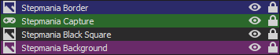

# Stepmania Stream Layout

Preview: 

Pre-configuration before setting up via OBS Studio:

0- This layout was made for the old school StepMania 3.9. It's also designed around the "In The Groove 2" custom theme. It may not align 1:1 with newer versions of Stepmania;

1- Open Stepmania;

2- Go to "Options";

3- Go to "Graphic Options";

4- Set the "Display Mode" to "WINDOWED";

5- Set the "Display Resolution" to "1280x960";

6- Go to "EXIT" at the bottom of the options list to save settings.

Instructions to set-up via OBS Studio:

1- Right click on "Scenes" empty box and create one for "Stepmania";

2- On the "Sources" empty box, go to "Add" and go to "Game Capture":

a) On "Mode", select "Capture specific window";

b) Window: "[StepMania.exe]: StepMania";

b-1) The Window name when using the "In The Groove 2" custom theme on StepMania 3.9 will be instead: "[StepMania.exe]: In The Groove".

c) Window Match Priority: "Match title, otherwise find window of same executable";

d) Press "OK".

3- Rename "Game Capture" to "Stepmania Capture" (you can do that by simply clicking on it from the Sources panel, and pressing F2);

4- Right-click on "Stepmania Capture", and go to "Transform" then "Center to screen".

5- Right-click on the "Sources" box, and Add an Image.

6- Select the "border.png" image, and press "OK".

7- Now right-click on the image you just added (I recommend renaming to "Stepmania Border"), and once again, go to "Transform" then "Center to screen".

8- Right-click on the "Sources" box, and Add yet another Image.

9- Select "bg.png", and press "OK".

10- Rename it to something like "Stepmania Background", and right-click on it, then go to "Filters":

a) Right-click on the "Effect Filters" area, and go to "Add" then "Scroll";

b) Keep the Horizontal Speed value as "100.00", and change the Vertical Speed to "0.00";

c) Enable "Limit Width", and set it to "1920";

d) Enable "Loop";

e) Right-click on the "Effect Filters" area, and go to "Add" then "Color Correction";

f) Set the opacity value to "0.5000";

11- Right-click on "Stepmania Background" once again, and go to "Transform" then "Center to screen".

14- Right-click on the "Sources" box, and Add another image;

15- Select "black_square.png" image, and press "OK".

16- Rename to something like "Stepmania Black Square", right-click it, go to "Transform", and click "Center to Screen".

The order for the Sources tab should look like this:

