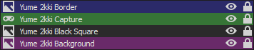

# Yume 2kki Stream Layout

Preview: 

(Previews are coming later)

Pre-configuration before setting up via OBS Studio:

1- Download the EasyRPG Player [here](https://easyrpg.org/player/downloads/), and drop to your Yume 2kki folder, where your "RPG_RT.exe" file is present;

2- Launch Yume 2kki by lauching "Player.exe";

3- Hit "Alt + Enter" to leave full screen mode, and keep Yume 2kki minimized;

4- Download Infinite Screen. It's available [here](https://web.archive.org/web/20221216153514/http://ynea.futureware.at/cgi-bin/infinite_screen.pl)(archived)¹ (link available on the blue "Infinite_Screen_v1.72.exe" text);

⎯⎯⎯⎯⎯⎯⎯⎯⎯⎯⎯⎯⎯⎯⎯⎯⎯⎯⎯⎯⎯⎯⎯⎯⎯⎯⎯⎯⎯⎯⎯⎯⎯⎯⎯⎯⎯⎯⎯⎯⎯⎯⎯⎯⎯⎯⎯⎯⎯⎯⎯⎯⎯⎯⎯⎯⎯⎯⎯⎯⎯⎯⎯⎯⎯⎯⎯⎯⎯⎯⎯⎯⎯⎯⎯⎯⎯⎯⎯⎯⎯⎯⎯⎯⎯⎯⎯⎯⎯⎯⎯⎯⎯⎯⎯⎯⎯⎯⎯⎯⎯⎯⎯⎯⎯⎯⎯⎯⎯⎯⎯⎯⎯⎯⎯⎯⎯⎯⎯⎯⎯⎯⎯⎯⎯⎯

***Note: Although I'm recommending this software to use (as I don't know any other free software that could do the same thing, the only other one that I know that has such funcionality is DisplayFusion, which has said functionality only on the paid version), Infinite Screen is an old and obscure software.***

***Additionally, in case you wish to uninstall it someday, just deleting "Infinite_screen_v1.72.exe" won't be enough, as the files for the software will still be located at "AppData\Local\Temp\infinite_screen\perl\bin". You can delete all files from this folder in case you don't wish to use the program anymore, or the entire "infinite_screen" folder inside "Temp", which will also get rid of your saved settings.***

¹: Due to the obscurity of the website that this software originated, I decided to include as an archive link from the Way Back Machine, in case the "futureware" website goes down someday and the new domain owner hosts a completely different webpage.

⎯⎯⎯⎯⎯⎯⎯⎯⎯⎯⎯⎯⎯⎯⎯⎯⎯⎯⎯⎯⎯⎯⎯⎯⎯⎯⎯⎯⎯⎯⎯⎯⎯⎯⎯⎯⎯⎯⎯⎯⎯⎯⎯⎯⎯⎯⎯⎯⎯⎯⎯⎯⎯⎯⎯⎯⎯⎯⎯⎯⎯⎯⎯⎯⎯⎯⎯⎯⎯⎯⎯⎯⎯⎯⎯⎯⎯⎯⎯⎯⎯⎯⎯⎯⎯⎯⎯⎯⎯⎯⎯⎯⎯⎯⎯⎯⎯⎯⎯⎯⎯⎯⎯⎯⎯⎯⎯⎯⎯⎯⎯⎯⎯⎯⎯⎯⎯⎯⎯⎯⎯⎯⎯⎯⎯⎯

5- Once downloaded somewhere to your computer, open it;

6- Disable all "Scroll types", and set to "Autostart at Boot" (so it opens alongside Windows, and stays with your tray icons);

7- Go to the "Oversize" tab, and look up for "CN: SDL_app | WN: ??2?? - EasyRPG Player | hWnd: 00151cae", and click it;

8- Set the "Width" value to "1300" and the "Height" value to "980", and enable the "4ever" option;

9- You'll have to manually hit "Alt + Enter" everytime you open the game, as well having to move the window to the center.

This will force the Yume 2kki's window to always be this size. In case you wish to change layouts in the future or anything, make sure that either Infinite Screen is not running anymore, or that the "4ever" option is not set.

Instructions to set-up via OBS Studio:

1- Right click on "Scenes" empty box and create one for "Yume 2kki";

2- On the "Sources" empty box, go to "Add" and go to "Game Capture":

a) On "Mode", select "Capture specific window";

b) Window: "[Player.exe]: ゆめ2っき - EasyRPG Player";

c) Window Match Priority: "Match title, otherwise find window of same executable";

d) Press "OK".

3- Rename "Game Capture" to "Yume 2kki Capture" (you can do that by simply clicking on it from the Sources panel, and pressing F2);

4- Right-click on "Yume 2kki Capture", and go to "Transform" then "Center to screen".

5- Right-click on the "Sources" box, and Add an Image.

6- Select the "border.png" image, and press "OK".

7- Now right-click on the image you just added (I recommend renaming to "Yume 2kki Border"), and once again, go to "Transform" then "Center to screen".

8- Right-click on the "Sources" box, and Add yet another Image.

9- Select "bg.png", and press "OK".

10- Rename it to something like "Yume 2kki Background", and right-click on it, then go to "Filters":

a) Right-click on the "Effect Filters" area, and go to "Add" then "Scroll";

b) Set the "Horizontal Speed" value to "-3.00", and set the "Vertical Speed" value to "-3.00";

c) Enable "Limit Width" and set it to "1920". Also enable "Limit Height" and set it to "1080";

d) Enable "Loop".

11- Right-click on "Yume 2kki Background" once again, and go to "Transform" then "Center to screen".

14- Right-click on the "Sources" box, and Add another image;

15- Select "black_square.png" image, and press "OK".

16- Rename to something like "Yume 2kki Black Square", right-click it, go to "Transform", and click "Center to Screen".

The order for the Sources tab should look like this:

